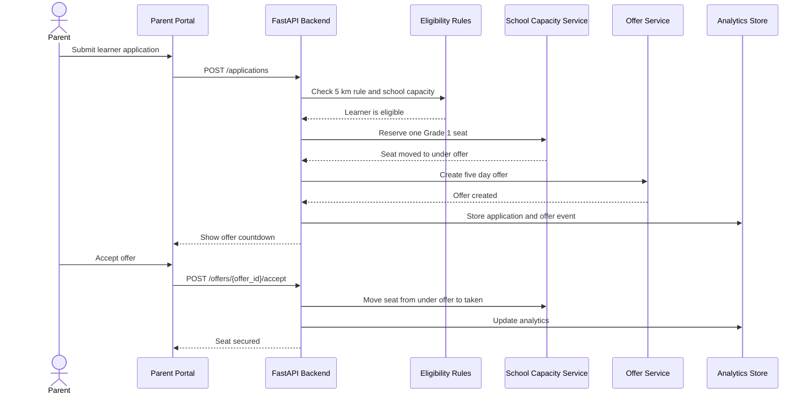

# Sequence Diagram for Draw.io

This diagram shows the demo flow from application to accepted offer.

```mermaid
sequenceDiagram
    actor Parent
    participant Portal as Parent Portal
    participant API as FastAPI Backend
    participant Rules as Eligibility Rules
    participant School as School Capacity Service
    participant Offer as Offer Service
    participant Data as Analytics Store

    Parent->>Portal: Submit learner application
    Portal->>API: POST /applications
    API->>Rules: Check 5 km rule and school capacity
    Rules-->>API: Learner is eligible
    API->>School: Reserve one Grade 1 seat
    School-->>API: Seat moved to under offer
    API->>Offer: Create five day offer
    Offer-->>API: Offer created
    API->>Data: Store application and offer event
    API-->>Portal: Show offer countdown
    Parent->>Portal: Accept offer
    Portal->>API: POST /offers/{offer_id}/accept
    API->>School: Move seat from under offer to taken
    API->>Data: Update analytics
    API-->>Portal: Seat secured
```
