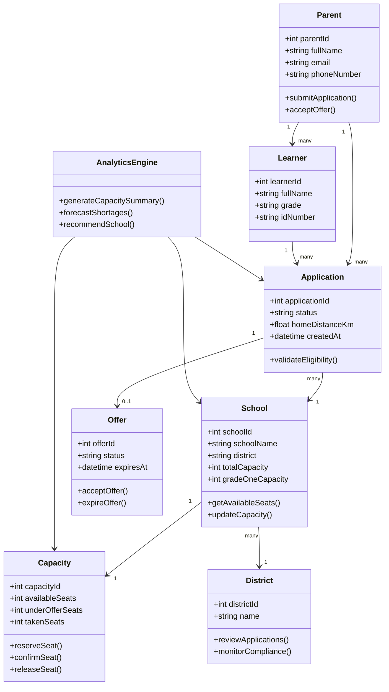

# UML Class Diagram for Draw.io

Open Draw.io, then use:

Arrange
Insert
Advanced
Mermaid

Paste this code.

```mermaid
classDiagram
    class Parent {
        +int parentId
        +string fullName
        +string email
        +string phoneNumber
        +submitApplication()
        +acceptOffer()
    }

    class Learner {
        +int learnerId
        +string fullName
        +string grade
        +string idNumber
    }

    class School {
        +int schoolId
        +string schoolName
        +string district
        +int totalCapacity
        +int gradeOneCapacity
        +getAvailableSeats()
        +updateCapacity()
    }

    class Application {
        +int applicationId
        +string status
        +float homeDistanceKm
        +datetime createdAt
        +validateEligibility()
    }

    class Offer {
        +int offerId
        +string status
        +datetime expiresAt
        +acceptOffer()
        +expireOffer()
    }

    class Capacity {
        +int capacityId
        +int availableSeats
        +int underOfferSeats
        +int takenSeats
        +reserveSeat()
        +confirmSeat()
        +releaseSeat()
    }

    class District {
        +int districtId
        +string name
        +reviewApplications()
        +monitorCompliance()
    }

    class AnalyticsEngine {
        +generateCapacitySummary()
        +forecastShortages()
        +recommendSchool()
    }

    Parent "1" --> "many" Learner
    Parent "1" --> "many" Application
    Learner "1" --> "many" Application
    Application "many" --> "1" School
    Application "1" --> "0..1" Offer
    School "1" --> "1" Capacity
    School "many" --> "1" District
    AnalyticsEngine --> Application
    AnalyticsEngine --> School
    AnalyticsEngine --> Capacity
```
